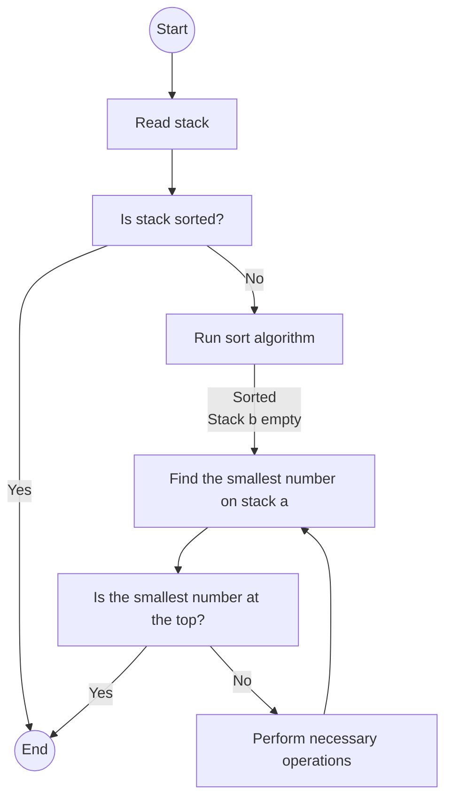
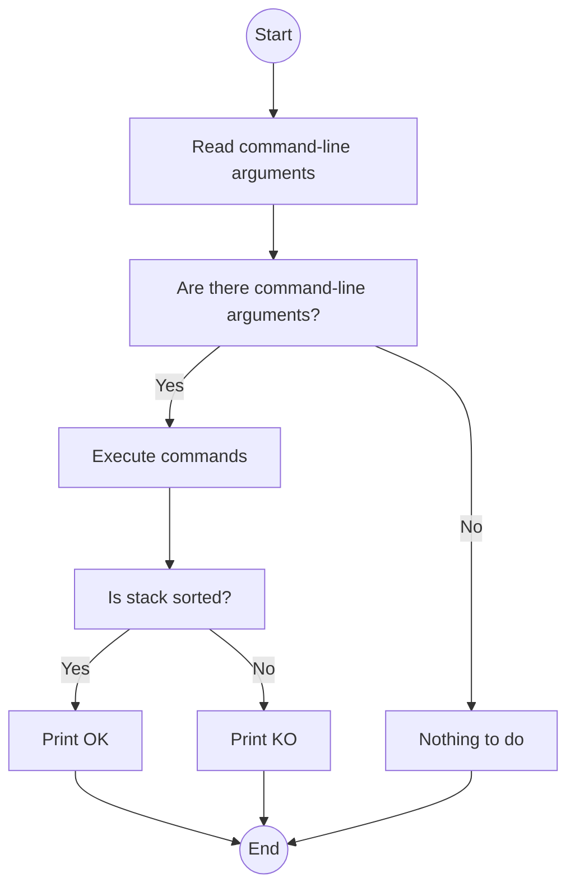
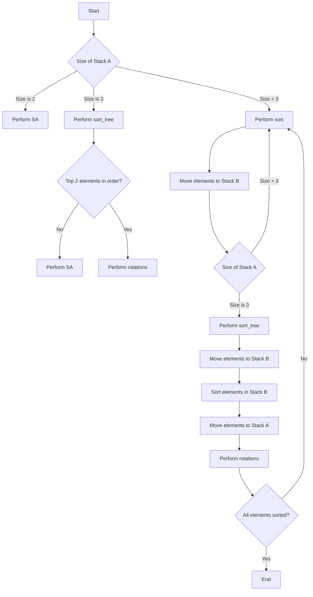

# Push_swap

`push_swap` is a sorting algorithm project developed as part of the 42 curriculum. The program takes a stack of integers as input and performs a series of operations to sort the stack in ascending order using only a predefined set of commands. The goal is to minimize the number of operations performed.


## Usage

To use `push_swap`, run the following command:

```
./push_swap [list of integers]
```

The program expects a list of integers as input. The integers can be provided as command-line arguments separated by spaces. For example:

```
./push_swap 5 2 7 1
```

Alternatively, you can provide a single string of space-separated integers:

```
./push_swap "5 2 7 1"
```

The program will output a series of operations that need to be performed on the stack to sort it. Each operation is represented by a command:

- `sa`: Swap the first two elements of stack A.
- `sb`: Swap the first two elements of stack B.
- `ss`: Perform `sa` and `sb` simultaneously.
- `pa`: Push the first element of stack B to stack A.
- `pb`: Push the first element of stack A to stack B.
- `ra`: Rotate stack A upwards (the first element becomes the last).
- `rb`: Rotate stack B upwards (the first element becomes the last).
- `rr`: Perform `ra` and `rb` simultaneously.
- `rra`: Rotate stack A downwards (the last element becomes the first).
- `rrb`: Rotate stack B downwards (the last element becomes the first).
- `rrr`: Perform `rra` and `rrb` simultaneously.

## Bonus: Checker

The project also includes making a bonus program called `checker`, which allows you to verify if a given list of operations correctly sorts a stack. To use the `checker` program, follow these steps:

1. Build the bonus program:

   ```shell
   make bonus
   ```

   This command will compile the bonus source code and generate an executable file called `checker`.

2. Run the program with a list of operations:

   ```shell
   ./checker <integer_list>
   ```

   Replace `<integer_list>` with a list of integers separated by spaces. For example:

   ```shell
   ./checker 42 10 7 15
   ```

To use the `checker` program, there are two possible ways:

1. Using `push_swap` and `checker` together:
   - Set the value of the `ARG` environment variable to a space-separated list of integers.
   - Execute the `push_swap` program with the value of `ARG` as input: `./push_swap $ARG`.
   - Pipe the output of `push_swap` to the `checker` program, providing `ARG` as an argument: `./checker $ARG`.
   
   Example:
   ```
   ARG="4 67 3 87 23"; ./push_swap $ARG | ./checker $ARG
   ```

2. Directly passing integers as command-line arguments:
   - Execute the `checker` program with the integers as command-line arguments.
   - Enter the series of commands, one command per line.
   - Press `Ctrl + D` to signal the end of input.
   
   Example:
   ```
   ./checker 3 2 1 0
   (after entering the commands)
   rra
   pb
   sa
   rra
   pa
   (press Ctrl + D)
   ```

The `checker` program will execute the commands and check if the stack is sorted. If the stack is sorted, it will print "OK"; otherwise, it will print "KO".

Using the `checker` program in either of these ways allows you to validate the sorting operations performed by `push_swap`. If the output is "OK," it means the stack is sorted correctly. Otherwise, if the output is "KO," it means the stack is not sorted correctly.

Let me know if you need any further clarification!

## Makefile

The project includes a Makefile with the following targets:

- `make`: Builds the `push_swap` program.
- `make bonus`: Builds the `checker` program.
- `make clean`: Removes the object files.
- `make fclean`: Removes the object files and executables.
- `make re`: Rebuilds the project from scratch.

Note: The Makefile assumes that the `libft` library is available in the `libft/` directory. 

## Cleanup

To clean up the compiled files, run the following command:

```
make clean
```

This will remove the object files generated during compilation.

To remove the `push_swap` and `checker` executables, run the following command:

```
make fclean
```

## Project Structure

The project is organized into the following files:

- `push_swap.h`: Header file containing function prototypes and macros used in the `push_swap` and `checker` programs.
- `push_swap.c`: Main entry point for the `push_swap` program.
- `checker.c`: Main entry point for the `checker` program.
- `push_swap_utils.c`: Utility functions used in the `push_swap` program.
- `stack_utils.c`: Functions for manipulating the stack data structure.
- `sort.c`: Sorting algorithms used in the `push_swap` program.
- `sort_utils.c`: Utility functions used in the sorting algorithms.
- `commands.c`: Functions for executing stack manipulation commands.
- `move_nodes.c`: Functions for moving nodes between stacks.
- `error.c`: Functions for error handling and exit conditions.
- `get_next_line.c`: Function for reading input from the standard input.


### Flowchart: push_swap



### Flowchart: checker



---
# **Algorithm**

The sorting algorithm used in my code follows a combination of techniques to sort the stack of integers. Here's an explanation of the logic behind the sorting algorithm:

1. **Initialization**:
   - The `stack_init` function reads the input integers and initializes Stack A.
   - It performs error checks for syntax, number range, and repetition.
   - The main function initializes Stack A and Stack B.

2. **Sorting**:
   - If Stack A is not already sorted (`!is_sorted(a)`), the sorting algorithm proceeds.
   - The algorithm differentiates between the sizes of Stack A to determine the sorting strategy:
     - If the size of Stack A is 2, the `move` function is called to perform the `SA` operation.
     - If the size of Stack A is 3, the `sort_tree` function is called to sort the three elements using specific operations.
     - For stack sizes greater than 3, the `sort` function is called to sort the stack using a combination of operations.

3. **Sort Tree**:
   - The `sort_tree` function finds the highest value in Stack A and determines its position relative to the top and the bottom of the stack.
   - Based on the position, the function performs the necessary rotations (`RA` or `RRA`) to bring the highest value to the top.
   - If the top two elements of Stack A are out of order, the function performs the `SA` operation to swap them.

4. **Sort Five**:
   - The `sort_five` function is called when the size of Stack A is 5.
   - It moves elements from Stack A to Stack B until only three elements remain in Stack A.
   - The `init_nodes` function initializes the nodes in both stacks to calculate prices and target nodes.
   - The `finish_rotation` function performs rotations (`RA` or `RRA`) to bring the target node to the top of Stack A.
   - The `move` function is used to move elements from Stack B to Stack A (`PA` operation).

5. **Sort (for sizes greater than 5)**:
   - The `sort` function is called for stack sizes greater than 5.
   - It moves elements from Stack A to Stack B until only three elements remain in Stack A.
   - The `move` function is used to move elements from Stack A to Stack B (`PB` operation).
   - The `sort_tree` function is called to sort the remaining three elements in Stack A.
   - The `move_nodes` function is called to move elements from Stack B back to Stack A (`PA` operation) based on their target nodes and prices.
   - The `set_current_position` function sets the position and bottom status of each node in Stack A.
   - The `find_smallest` function is used to find the smallest element in Stack A.
   - The `move` function is used to perform rotations (`RA` or `RRA`) to bring the smallest element to the top of Stack A.

6. **Stack Utilities**:
   - The `stack_utils` module provides utility functions to manipulate stacks, such as appending nodes, determining stack size, checking for sorting, and finding the smallest node.

7. **Move Nodes**:
   - The `move_nodes` function is responsible for moving nodes between Stack A and Stack B based on their target nodes and prices.
   - The `return_cheapest` function finds the node in Stack B with the lowest price.
   - The `finish_rotation` function performs rotations (`RB` or `RRB`) to bring the cheapest node in Stack B to its target position.
   - The `move` function is used to move the node from Stack B to

 Stack A (`PA` operation).

8. **Sort Utilities**:
   - The `init_nodes` function initializes the nodes in both stacks to calculate prices and target nodes.
   - The `set_current_position` function sets the position and bottom status of each node in both stacks.
   - The `set_target_node` function determines the target node for each node in Stack B by finding the nearest larger value in Stack A.
   - The `set_price` function assigns a price value to each node in Stack B based on its position, target position, and bottom status.

The flowchart below represents the logical flow of the sorting algorithm:



This flowchart illustrates the decision-making process based on the size of Stack A and the state of the elements during the sorting algorithm.
