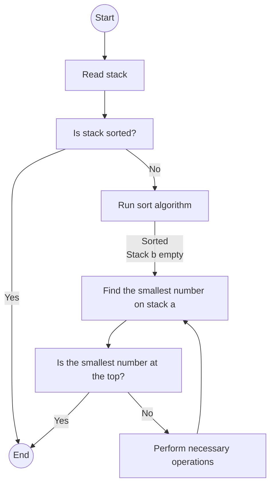
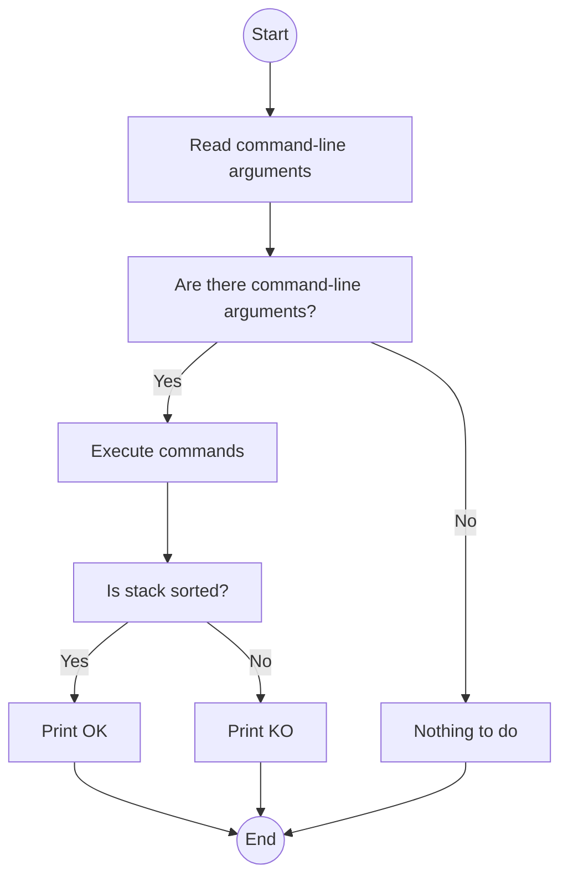

# Push_swap

`push_swap` is a sorting algorithm project developed as part of the 42 curriculum. The program takes a stack of integers as input and performs a series of operations to sort the stack in ascending order using only a predefined set of commands. The goal is to minimize the number of operations performed.


## Usage

To use `push_swap`, run the following command:

```
./push_swap [list of integers]
```

The program expects a list of integers as input. The integers can be provided as command-line arguments separated by spaces. For example:

```
./push_swap 5 2 7 1
```

Alternatively, you can provide a single string of space-separated integers:

```
./push_swap "5 2 7 1"
```

The program will output a series of operations that need to be performed on the stack to sort it. Each operation is represented by a command:

- `sa`: Swap the first two elements of stack A.
- `sb`: Swap the first two elements of stack B.
- `ss`: Perform `sa` and `sb` simultaneously.
- `pa`: Push the first element of stack B to stack A.
- `pb`: Push the first element of stack A to stack B.
- `ra`: Rotate stack A upwards (the first element becomes the last).
- `rb`: Rotate stack B upwards (the first element becomes the last).
- `rr`: Perform `ra` and `rb` simultaneously.
- `rra`: Rotate stack A downwards (the last element becomes the first).
- `rrb`: Rotate stack B downwards (the last element becomes the first).
- `rrr`: Perform `rra` and `rrb` simultaneously.

## Bonus: Checker

The project also includes making a bonus program called `checker`, which allows you to verify if a given list of operations correctly sorts a stack. To use the `checker` program, follow these steps:

1. Build the bonus program:

   ```shell
   make bonus
   ```

   This command will compile the bonus source code and generate an executable file called `checker`.

2. Run the program with a list of operations:

   ```shell
   ./checker <integer_list>
   ```

   Replace `<integer_list>` with a list of integers separated by spaces. For example:

   ```shell
   ./checker 42 10 7 15
   ```

To use the `checker` program, there are two possible ways:

1. Using `push_swap` and `checker` together:
   - Set the value of the `ARG` environment variable to a space-separated list of integers.
   - Execute the `push_swap` program with the value of `ARG` as input: `./push_swap $ARG`.
   - Pipe the output of `push_swap` to the `checker` program, providing `ARG` as an argument: `./checker $ARG`.
   
   Example:
   ```
   ARG="4 67 3 87 23"; ./push_swap $ARG | ./checker $ARG
   ```

2. Directly passing integers as command-line arguments:
   - Execute the `checker` program with the integers as command-line arguments.
   - Enter the series of commands, one command per line.
   - Press `Ctrl + D` to signal the end of input.
   
   Example:
   ```
   ./checker 3 2 1 0
   (after entering the commands)
   rra
   pb
   sa
   rra
   pa
   (press Ctrl + D)
   ```

The `checker` program will execute the commands and check if the stack is sorted. If the stack is sorted, it will print "OK"; otherwise, it will print "KO".

Using the `checker` program in either of these ways allows you to validate the sorting operations performed by `push_swap`. If the output is "OK," it means the stack is sorted correctly. Otherwise, if the output is "KO," it means the stack is not sorted correctly.

Let me know if you need any further clarification!

## Makefile

The project includes a Makefile with the following targets:

- `make`: Builds the `push_swap` program.
- `make bonus`: Builds the `checker` program.
- `make clean`: Removes the object files.
- `make fclean`: Removes the object files and executables.
- `make re`: Rebuilds the project from scratch.

Note: The Makefile assumes that the `libft` library is available in the `libft/` directory. 

## Cleanup

To clean up the compiled files, run the following command:

```
make clean
```

This will remove the object files generated during compilation.

To remove the `push_swap` and `checker` executables, run the following command:

```
make fclean
```

## Project Structure

The project is organized into the following files:

- `push_swap.h`: Header file containing function prototypes and macros used in the `push_swap` and `checker` programs.
- `push_swap.c`: Main entry point for the `push_swap` program.
- `checker.c`: Main entry point for the `checker` program.
- `push_swap_utils.c`: Utility functions used in the `push_swap` program.
- `stack_utils.c`: Functions for manipulating the stack data structure.
- `sort.c`: Sorting algorithms used in the `push_swap` program.
- `sort_utils.c`: Utility functions used in the sorting algorithms.
- `commands.c`: Functions for executing stack manipulation commands.
- `move_nodes.c`: Functions for moving nodes between stacks.
- `error.c`: Functions for error handling and exit conditions.
- `get_next_line.c`: Function for reading input from the standard input.


### Flowchart: push_swap



### Flowchart: checker



---
